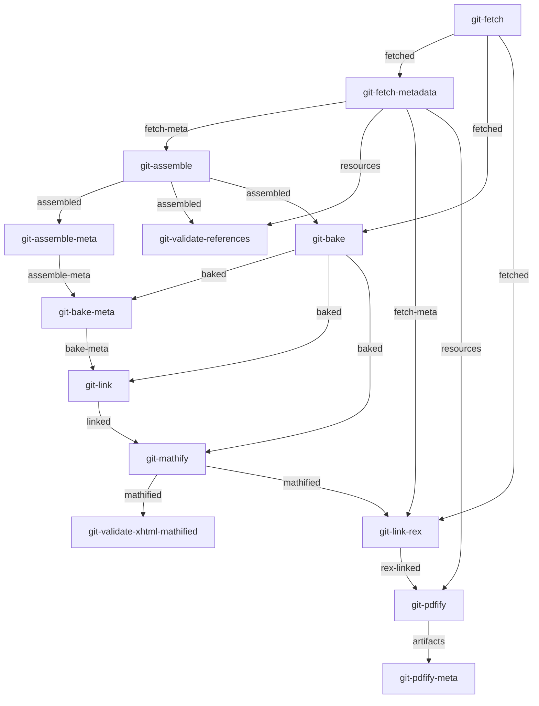

# About

[](https://app.codecov.io/gh/openstax/enki) [](https://gitpod.io/#https://github.com/openstax/enki)

We build books in a pipeline of steps. These steps are written in different languages and need to run on a server as well as locally for development.


# Table of Contents

- [Local Instructions](#local-instructions)
  * [Private Repositories](#private-repositories)
  * [Google Docs](#google-docs)
- [Steps](#steps)
- [Environment Variables](#environment-variables)
  * [Common Environment Variables](#common-environment-variables)
  * [Authentication Secrets](#authentication-secrets)
  * [Artifact and Queue Buckets](#artifact-and-queue-buckets)
  * [Pipeline-generation Environment Variables](#pipeline-generation-environment-variables)
  * [Internal environment variables](#internal-environment-variables)
- [Features](#features)
  * [Run Tests](#run-tests)
  * [Run one step](#run-one-step)
  * [Run steps beginning with a step](#run-steps-beginning-with-a-step)
- [CI/Gitpod Integration](#cigitpod-integration)
- [TODO list](#todo-list)


# Local Instructions

This uses a little wrapper to hide all the docker commands.

## Clone & Install Submodules

1. Clone this repositoriy
1. Ensure submodules are checked out by running `./install-submodules.sh`
1. (Optional) Copy the .env.example and fill in the values and source the environment. 
1. Run the tests: `./test.sh` to verify everything works

Then try the following to build PDFs and other formats:

```sh
# All-in-one Git-based books
#  CLI             command             repo_name                        book_slug
./enki --command all-git-pdf --repo 'philschatz/tiny-book' --book-slug 'book-slug1' --style default
./enki --command all-git-web --repo 'philschatz/tiny-book' --book-slug 'book-slug1' --style default --ref main
# GH_SECRET_CREDS='..' before running enki for private repositories

# Start up a local REX Preview (after running all-git-web)
./enki --command rex-preview

# All-in-one Archive-based books
#  CLI           command                col_id           recipe                version
./enki --command all-archive-pdf --repo col12006 --style college-physics --ref latest
./enki --command all-archive-pdf --repo col11762 --style sociology       --ref latest
./enki --command all-archive-web --repo col11762 --style sociology       --ref latest
```

## Private Repositories

To clone private repositories there are 2 options:

### Set a GitHub token

This is how production works but it can be annoying to clone a whole book all the time.

You will need to set a `GH_SECRET_CREDS` environment variable. To do that, create a token at https://github.com/settings/tokens and ensure the `repo` scope is selected. Then, set `GH_SECRET_CREDS={the_token}:x-oauth-basic` in the `.env` file
in this directory and run the cli.

### Sideload the book

If you already have the files locally, you can specify a path to them and the CLI can sideload them in instead of fetching from GitHub.

To use this method, use the `--sideload` argument to specify where to load the book from.

## Google Docs

To upload DOCX files to **Google Docs** follow the [instructions here](./google-docs.md). To build a Google Docs pipeline, run `npm run build:gdocs` in [./build-concourse/](./build-concourse/)

# Steps

Here is an autogenerated graph of all the steps to build a PDF using `all-git-pdf`. For more see the [graphs here](./build-concourse/graphs/):

<!-- AUTOGEN-GRAPH-START:all-git-pdf -->

<!-- AUTOGEN-GRAPH-END:all-git-pdf -->


# Environment Variables

This project uses environment variables extensively to set things like:

- Trace Logging
- Mounting a custom `cookbook/` directory
- Skipping certain steps
- AWS authentication credentials
- Google authentication credentials

See [./.env.example](./.env.example) for all the environment variables and examples.

## Artifact and Queue Buckets

The book pipeline uses S3 buckets to accomplish two different goals: Uploading artifacts and keeping the state of which books have been built (webhosting pipeline)

| Name | Use | Description |
| :--- | :-- | :---------- |
| `WEB_QUEUE_STATE_S3_BUCKET` | Queue | When a book has completed building, the file in this bucket is updated
| `S3_QUEUE` | Queue | Webhosting and GDocs pipeline stores a queue of books that need to be built. It is one file with multiple versions
| `CORGI_ARTIFACTS_S3_BUCKET` | State | CORGI job artifacts (PDF, Webhosting JSON files, GDocs DOCX files) are uploaded here
| `WEB_S3_BUCKET` | State | Webhosting JSON files are uploaded to this bucket


## Pipeline-generation Environment Variables

The pipeline-generation code uses a few additional environment variables:

| Name | Use | Description |
| :--- | :-- | :---------- |
| `DOCKERHUB_USERNAME` | | Your DockerHub username in case you are rate-limited
| `DOCKERHUB_PASSWORD` | | Your DockerHub password in case you are rate-limited


# Features

- Dependency Graph explicitly in code (concourse steps, local steps, and graphical documentation are all kept in sync)
- Scripts for the build steps allows using a Dockerfile as well as rebuilding if code is updated inside the container (e.g. developer runnig the container in gitpod or vscode)
- Integration tests and code coverage

In order to support both use-cases, all the steps are included in one Docker container and parameters are specified as environment variables.

Input/output directores for each step are specified as environment variables because local development does not need different directories but the production builds in concourse-CI use different input/output directories for each step.

The code is organized as follows:

- [Dockerfile](./Dockerfile) contains a multi-stage build and builds all the code necessary to build a PDF, webhosting JSON, or DOCX files ready to upload to Google Docs
- [dockerfiles/build/](./dockerfiles/build/) scripts that build the code in the container
- [dockerfiles/steps/](./dockerfiles/steps/) contains the code for each step (e.g. fetch, assemble, bake, mathify) as well as convenience `all-*` steps which are only for local development
- [enki](./enki) is the start for developers building books locally on their machine
- [build-concourse/](./build-concourse/) contains scripts (`npm start`) that generate Concourse Pipeline YAML files for the different CORGI environments (production, staging, local) and different webhosting environments (production, sandbox, local)
- [step-definitions.ts](build-concourse/step-definitions.ts) The dependency graph for all builds
    - [step-config.json](./step-config.json) Autogenerated file so the dependency graph can be used inside the container in shell scripts
    - [graphs/](./build-concourse/graphs/) Autogenerated graphs showing each step in the pipelines


# Development

In order to debug steps inside the container you can start a shell instead of running a step.
To run a shell inside the container run the following:

```bash
./enki --command shell
```

Then, to run the step inside the container, run `docker-entrypoint.sh {step_name}`.


## Run Tests

1. Run `./test.sh`
1. Open `./coverage/index.html` in a browser to see coverage


## Run one step

If you want to run a single step at a time specify it as the first argument. Later steps use files in the data directory to remember which book & version is being used.

```sh
# Common steps
./enki --command local-create-book-directory col11762 sociology latest
./enki --command look-up-book
./enki --command archive-fetch
./enki --command archive-assemble
./enki --command archive-link-extras
./enki --command archive-bake

# PDF steps
./enki --command archive-mathify
./enki --command archive-pdf

# Concourse-only steps (AWS_ environemnt variables will likely need to be set)
CODE_VERSION='main' \
ARG_WEB_QUEUE_STATE_S3_BUCKET=openstax-sandbox-web-hosting-content-queue-state \
./enki --command archive-report-book-complete
```

With the above command, docker will use the `$(pwd)/data/...` directory to read/write files during each step.

## Run steps beginning with a step

Often, developers would like to rerun only part of the pipeline (e.g. `bake`) to skip expensive steps like fetching the book contents.

Use the `START_AT_STEP=` environment variable. Example:

```sh
START_AT_STEP=git-bake ./enki ./data/tin-bk all-git-pdf
```

**Note:** The arguments following all-git-pdf can be omitted since they are only used in the initial step


# CI/Gitpod Integration

This repo can be used as the image in a gitpod environment. All of code to build the variaous dependencies (like `cookbook`) are in bash scripts inside the container so they can be run from within the container (see [Dockerfile](./Dockerfile))

# TODO list

- [x] Build Archive PDF
- [x] Build Archive JSON
- [x] Build Git PDF
- [x] Build Git JSON
- [x] Support checking out a commit instead of a branch/tag
- [x] Change entrypoint script to use environment variables for directories instead of assuming `/data/{name}`
    - search for `mv ` in build-concourse/script
- [x] Create a pipeline in concourse
- [x] Add the output-producer-resource repo into here
- [ ] add back support for content servers and content versions
- [x] verify the webhosting job uploaded: http://localhost:8080/teams/main/pipelines/webhosting/jobs/bakery/builds/4.1
- [x] verify the pipeline resource runs instead of the output-producer-resource
- [x] add the post-webhosting-push task of updating S3 to mark the job as done (check concourse-v6 for this task)
    - a.k.a. add webhosting "report book complete" task which uploads to the Queue bucket (yet another bucket)
- [x] combine gitTaskMaker and archiveTaskMaker into one generic taskMaker since the shell script will be tiny
- [x] add google docs pipeline-generation
- [x] auto-build a dependency graph image for documentation [./build-concourse/graphs/](./build-concourse/graphs/)
- [x] auto-build the bash script
- [x] wire up codecov.io ([Example](https://codecov.io/gh/openstax/enki/src/85ee2ea16a401ca07067af699350157b29bdc763/dockerfiles/docker-entrypoint.sh))
- [x] move all the steps into a JSON file so it can be parsed in node and bash
- [x] move the bash code for each step into a separate bash file and ensure codecov checks it
- [x] make the docker-entrypoint script use the JSON file to validate inputs, environment variables, and run the correct step
- [x] add code coverage for the TypeScript files
- [x] Move everything out of the pipeline and into the image
- [x] shellcheck the bash scripts (`shellcheck --severity=warning ./dockerfiles/steps/*`)
- [x] make it easy to rebuild and run inside gitpod (inside the container). Requires moving commands in Dockerfile into scripts again
- [x] Update the readme to show where the magic files are and how they fit together
- [ ] lint TypeScript files
- [ ] get vscode to recognize the filesystem imports in the TypeScript files
- [ ] combine `cli.env` and `gitpod.env` to just one file that uses `./data/`
- [ ] webhosting for git books
- [ ] remove the `git-` prefix from tasks so they wil ljust work when we remove archive tasks
- [ ] remove virtualenv and install python packages to the system (unless it's bad practice)

## Future TODO work

- [ ] shellcheck entrypoint bash scripts
- [ ] Read book list from `META-INF/books.xml` instead of `ls *.collection.xml` using xmlstarlet
- [ ] Consistent if;then, quotes (or not) around variables, and curly braces around variables
- [ ] move pm2 into bakery-scripts/ instead of being installed globally in the Dockerfile
- [ ] move auth secret rotation into this repo. See https://github.com/openstax/output-producer-service/pull/355
