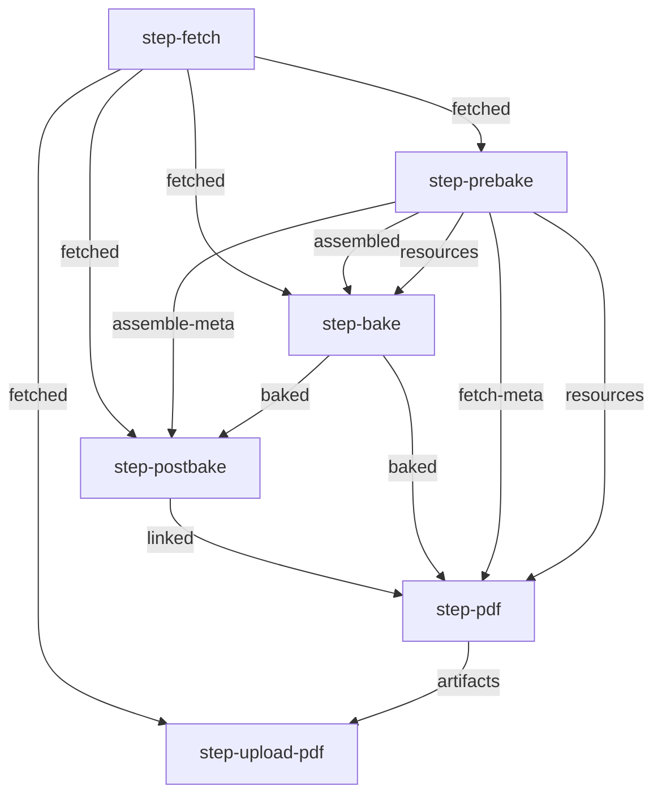

# About

[](https://app.codecov.io/gh/openstax/enki) [](https://gitpod.io/#https://github.com/openstax/enki)

We build books in a pipeline of steps. These steps are written in different languages and need to run on a server as well as locally for development.


# Table of Contents

- [About](#about)
- [Table of Contents](#table-of-contents)
- [Local Instructions](#local-instructions)
  - [Clone \& Install Submodules](#clone--install-submodules)
    - [REX preview](#rex-preview)
    - [local preview of HTML files](#local-preview-of-html-files)
  - [Private Repositories](#private-repositories)
    - [Set a GitHub token](#set-a-github-token)
    - [Sideload the book](#sideload-the-book)
  - [Google Docs](#google-docs)
- [Steps](#steps)
- [Environment Variables](#environment-variables)
  - [Artifact and Queue Buckets](#artifact-and-queue-buckets)
- [Features](#features)
- [Development](#development)
  - [Run Tests](#run-tests)
  - [Run steps beginning with a step](#run-steps-beginning-with-a-step)
  - [Debugging](#debugging)
    - [Python Debugging](#python-debugging)
    - [Java Debugging](#java-debugging)
    - [Javascript Debugging](#javascript-debugging)
- [CI Integration](#ci-integration)
- [Running the Enki command in Gitpod](#running-the-enki-command-in-gitpod)
  - [Gitpod Differences](#gitpod-differences)
  - [Submodule Development](#submodule-development)
- [Create a Webhosting Pipeline](#create-a-webhosting-pipeline)
- [TODO list](#todo-list)
  - [Future TODO work](#future-todo-work)


# Local Instructions

This uses a little wrapper to hide all the docker commands.

**Note:** See [docs-pipeline.md](./docs-pipeline.md) to know what each of the steps do and which files they expect/generate.

## Clone & Install Submodules

1. Clone this repositoriy
1. Ensure submodules are checked out by running `./install-submodules.sh`
1. (Optional) Copy the .env.example and fill in the values and source the environment. 
1. Run the tests: `./test.sh` to verify everything works

Then try the following to build PDFs and other formats:

```sh
# All-in-one Git-based books
#  CLI             command             repo_name                        book_slug (optional)
./enki --command all-pdf  --repo 'philschatz/tiny-book' --book-slug 'book-slug1' --ref main
./enki --command all-web  --repo 'philschatz/tiny-book' --ref main
./enki --command all-epub --repo 'openstax/osbooks-introduction-anthropology' --book-slug 'introduction-anthropology' --ref main
# GH_SECRET_CREDS='..' before running enki for private repositories
```

Note that if `book_slug` is not provided, all books in the repo will be built by default.

### REX preview

For REX preview you need to build a `all-web` book and run rex-preview command.

**Important Note:** You need to turn off any sort of adblocker for `https://rex-web.herokuapp.com` for the preview to work! Don't use Safari because the internal tracker blocker there also breaks REX preview!

Example with using a custom data "rextest" directory:

```sh
./enki --command all-web --repo 'philschatz/tiny-book' --data-dir ./data/rextest/ --book-slug 'book-slug1' --ref main
# Start up a local REX Preview (after running all-web)
./enki --command rex-preview --data-dir ./data/rextest/
```

The rex-preview command will first open an error page for all collections built which can be opened in the browser. To navigate to the real modules use the navigation on left side.

`Ctrl+C` will stop rex-preview.

### local preview of HTML files

For local preview of HTML files with working image resources you need to build a `all-web` book and run `local-preview` command.

Example with using a custom data `localptest` directory:

```sh
./enki --command all-web --repo 'philschatz/tiny-book' --data-dir ./data/localptest/ --book-slug 'book-slug1' --ref main
# Start up a local preview (after running all-web)
./enki --command local-preview --data-dir ./data/localptest/
```

The `local-preview` command will show you that you can open the HTML files in directory `./data/localptest/contents`. Simply change `cd` into this directory and open the html files in a browser.

## Private Repositories

To clone private repositories there are 2 options:

### Set a GitHub token

This is how production works but it can be annoying to clone a whole book all the time.

You will need to set a `GH_SECRET_CREDS` environment variable. To do that, create a token at https://github.com/settings/tokens and ensure the `repo` scope is selected. Then, set `GH_SECRET_CREDS={the_token}:x-oauth-basic` in the `.env` file
in this directory and run the cli.

### Sideload the book

If you already have the files locally, you can specify a path to them and the CLI can sideload them in instead of fetching from GitHub.

To use this method, use the `--sideload` argument to specify where to load the book from.

## Google Docs

To upload DOCX files to **Google Docs** follow the [instructions here](./google-docs.md). To build a Google Docs pipeline, run `npm run build:gdocs` in [./build-concourse/](./build-concourse/)

# Steps

Here is an autogenerated graph of all the steps to build a PDF using `all-pdf`. For more see the [graphs here](./build-concourse/graphs/):

<!-- AUTOGEN-GRAPH-START:all-pdf -->

<!-- AUTOGEN-GRAPH-END:all-pdf -->


# Environment Variables

This project uses environment variables extensively to set things like:

- Trace Logging
- Mounting a custom `cookbook/` directory
- Skipping certain steps
- AWS authentication credentials
- Google authentication credentials

See [./.env.example](./.env.example) for all the environment variables and examples.

## Artifact and Queue Buckets

The book pipeline uses S3 buckets to accomplish two different goals: Uploading artifacts and keeping the state of which books have been built (webhosting pipeline)

| Name | Use | Description |
| :--- | :-- | :---------- |
| `WEB_QUEUE_STATE_S3_BUCKET` | Queue | When a book has completed building, the file in this bucket is updated
| `S3_QUEUE` | Queue | Webhosting and GDocs pipeline stores a queue of books that need to be built. It is one file with multiple versions
| `CORGI_ARTIFACTS_S3_BUCKET` | State | CORGI job artifacts (PDF, Webhosting JSON files, GDocs DOCX files) are uploaded here
| `WEB_S3_BUCKET` | State | Webhosting JSON files are uploaded to this bucket


# Features

- Dependency Graph explicitly in code (concourse steps, local steps, and graphical documentation are all kept in sync)
- Scripts for the build steps allows using a Dockerfile as well as rebuilding if code is updated inside the container (e.g. developer runnig the container in gitpod or vscode)
- Integration tests and code coverage

In order to support both use-cases, all the steps are included in one Docker container and parameters are specified as environment variables.

Input/output directores for each step are specified as environment variables because local development does not need different directories but the production builds in concourse-CI use different input/output directories for each step.

The code is organized as follows:

- [Dockerfile](./Dockerfile) contains a multi-stage build and builds all the code necessary to build a PDF, webhosting JSON, or DOCX files ready to upload to Google Docs
- [dockerfiles/build/](./dockerfiles/build/) scripts that build the code in the container
- [dockerfiles/steps/](./dockerfiles/steps/) contains the code for each step (e.g. fetch, assemble, bake, mathify) as well as convenience `all-*` steps which are only for local development
- [enki](./enki) is the start for developers building books locally on their machine
- [build-concourse/](./build-concourse/) contains scripts (`npm start`) that generate Concourse Pipeline YAML files for the different CORGI environments (production, staging, local) and different webhosting environments (production, sandbox, local)
- [step-definitions.ts](build-concourse/step-definitions.ts) The dependency graph for all builds
    - [step-config.json](./step-config.json) Autogenerated file so the dependency graph can be used inside the container in shell scripts
    - [graphs/](./build-concourse/graphs/) Autogenerated graphs showing each step in the pipelines


# Development

In order to debug steps inside the container you can start a shell instead of running a step.
To run a shell inside the container run the following:

```bash
./enki --command shell
```

Then, to run the step inside the container, run `docker-entrypoint.sh {step_name}`.


## Run Tests

1. Run `./test.sh`
1. Open `./coverage/index.html` in a browser to see coverage


## Run steps beginning with a step

Often, developers would like to rerun only part of the pipeline (e.g. `bake`) to skip expensive steps like fetching the book contents.

Use the `START_AT_STEP=` environment variable. Example:

```sh
START_AT_STEP=git-bake ./enki ./data/tin-bk all-pdf
```

**Note:** The arguments following all-pdf can be omitted since they are only used in the initial step


## Debugging

### Python Debugging

In order to debug a python script from the `./bakery-src/scripts` folder, you can add the `--pdb` flag to the `./enki` command. This will open the `5678` port on the container and allow you to connect to it with a debugger.
In addition, you should add the following script on top of the python script you want to debug and set breakpoints below the `debug()` line:

```python
from .profiler import debug
debug()
```

### Java Debugging

In order to debug the Java code, you can set the breakpoints in the Java code and then run the `./enki` command with the `--jdb` flag. The java program will then suspend till the client is connected to it and stop at the breakpoints and you can step through the code.

### Javascript Debugging

In order to debug the Javascript code, you can set the breakpoints in the Javascript code under `bakery-js/src` and then run the `./enki` command with the `--jsdb` flag. The node program will then suspend till the client is connected to it and stop at the breakpoints and you can step through the code.

# CI Integration

This repo can be used as the image in a gitpod environment. All of code to build the variaous dependencies (like `cookbook`) are in bash scripts inside the container so they can be run from within the container (see [Dockerfile](./Dockerfile))


# Running the Enki command in Gitpod

1. Open the [Enki Repository in Gitpod](https://gitpod.io/from-referrer/)
2. Follow [Local Instructions](#local-instructions) to build a book
    * **NOTE:** You will want to set a `--data-dir` that is relative to your working directory (like `./data`) so that artifacts are easy to download/preview

## Gitpod Differences
* Local preview can be utilized via the Live Server extension that should be preinstalled in the Gitpod workspace
  1. Starting Live Server
      * Open the command palette and run "Open with Live Server" 
      * OR Right click an html document and click "Open with Live Server" 
      * OR CMD + L followed by CMD + O
  2. When you start Live Server, a new tab that shows a directory listing should open in your browser 
      * If a tab does not open automatically
          1. Open your terminal (Control + \` OR `Create New Terminal` in command palette)
          2. If you do not see a `Ports` tab above your terminal, right click the bar and check the `Ports` option
          3. Click ports. You should see that port 5500 is open. If not, make sure that Live Server is running.
          4. Click the address or the Globe icon. That should open the aforementioned directory listing
  3. Navigate to your local preview.
      * In my case, I ran `./enki --command local-preview --data-dir ./data/localptest`, so my local preview was in `data/localptest/local-preview/contents`
* Build artifacts need to be downloaded
  You can download build artifacts like pdfs and zips by locating them in the explorer panel, right clicking them, and click `Download...`

## Submodule Development
* Submodules like nebuchadnezzar, cookbook, etc. can be used like any other git repository. You can checkout branches, modify files, pull or push changes, and anything else you might do with a git repository.
* When a submodule is changed, the Enki image should automatically rebuild the layers that were affected by the change. 


# Create a Webhosting Pipeline

Find out which codeversion to use (`<codeversion>`). Then run the following in the [./build-concourse/](./build-concourse/) directory:

```shell
# cd ./build-concourse

npm install

# Build the concourse pipeline YAML file
CODE_VERSION=<codeversion> npm run build

# Upload
fly --target=prod set-pipeline --pipeline=webhost-prod-<codeversion> --config=./webhosting-production.yml 

# Unpause the pipeline (via the UI or via the command that prints out)
```

# TODO list

- [ ] lint TypeScript files
- [ ] get vscode to recognize the filesystem imports in the TypeScript files
- [ ] remove the `git-` prefix from tasks so they wil ljust work when we remove archive tasks
- [ ] remove virtualenv and install python packages to the system (unless it's bad practice)

## Future TODO work

- [ ] shellcheck entrypoint bash scripts
- [ ] Read book list from `META-INF/books.xml` instead of `ls *.collection.xml` using xmlstarlet
- [ ] Consistent if;then, quotes (or not) around variables, and curly braces around variables
- [ ] move pm2 into bakery-scripts/ instead of being installed globally in the Dockerfile
- [ ] move auth secret rotation into this repo. See https://github.com/openstax/output-producer-service/pull/355
