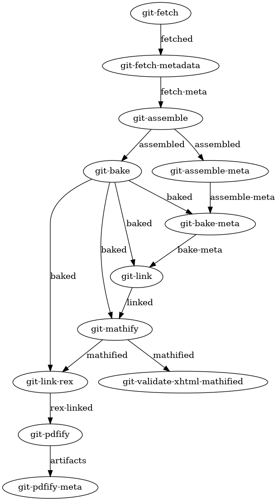
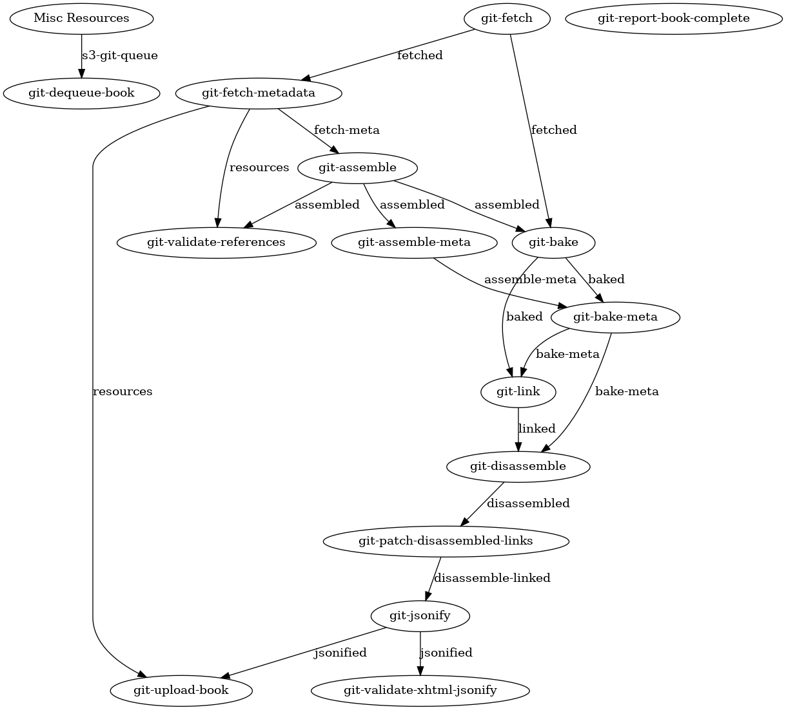
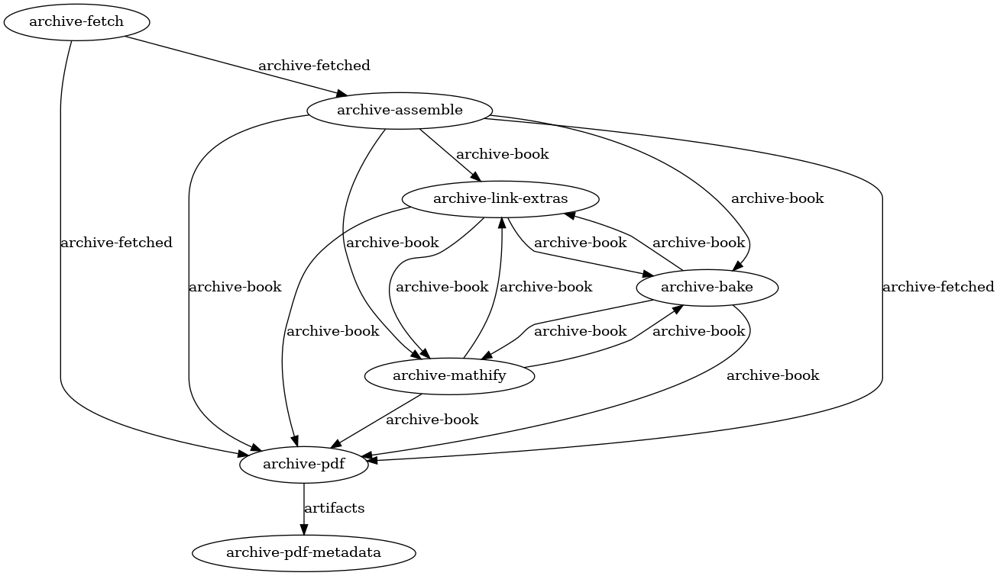
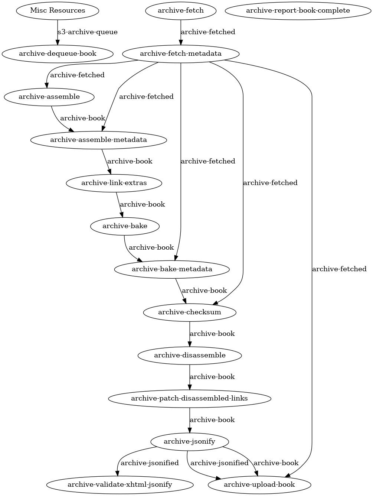
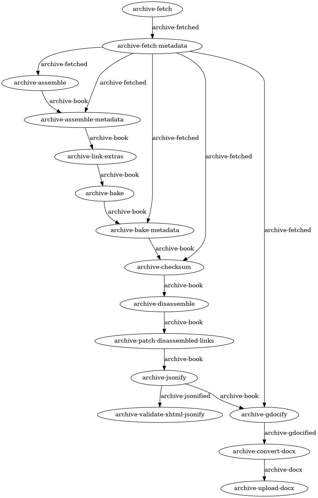

This directory contains autogenerated images of the different pipelines.

They are generated by running `npm run build:graphs` in the parent directory.

- [all-git-pdf](#all-git-pdf)
- [all-git-web](#all-git-web)
- [all-archive-pdf](#all-archive-pdf)
- [all-archive-web](#all-archive-web)
- [all-archive-gdocs](#all-archive-gdocs)

# all-git-pdf

# all-git-web

# all-archive-pdf

# all-archive-web

# all-archive-gdocs

