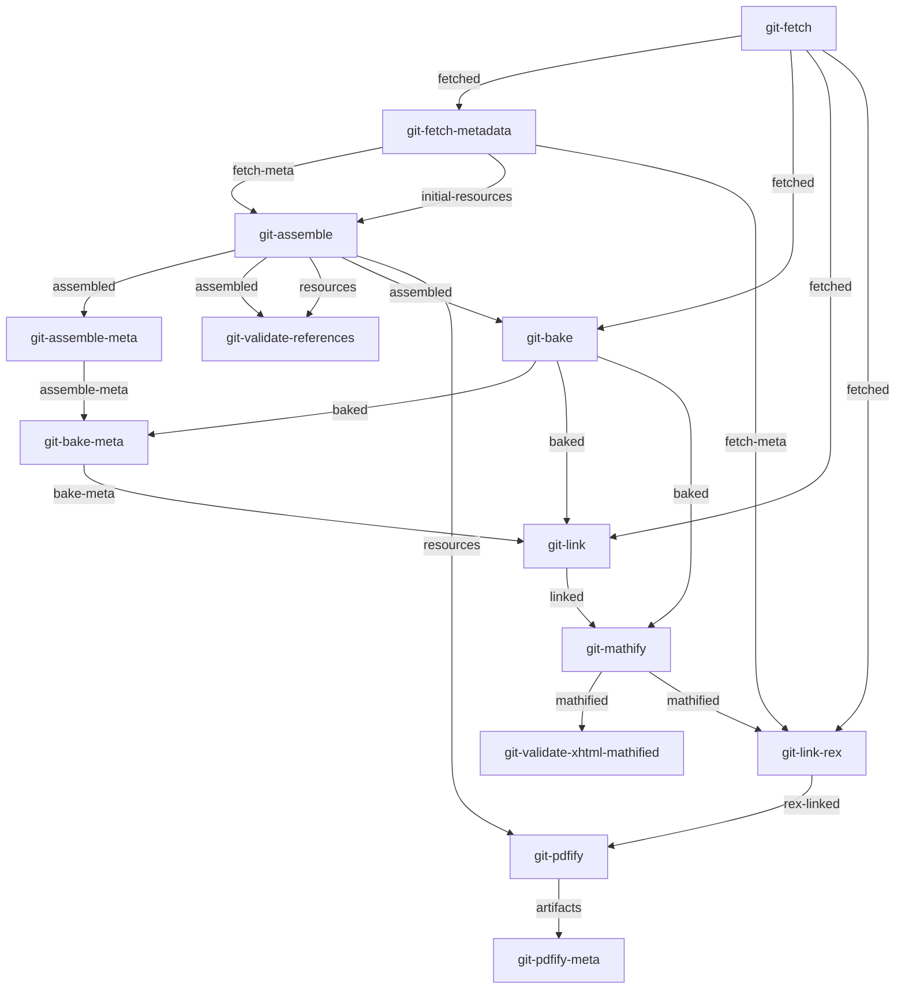
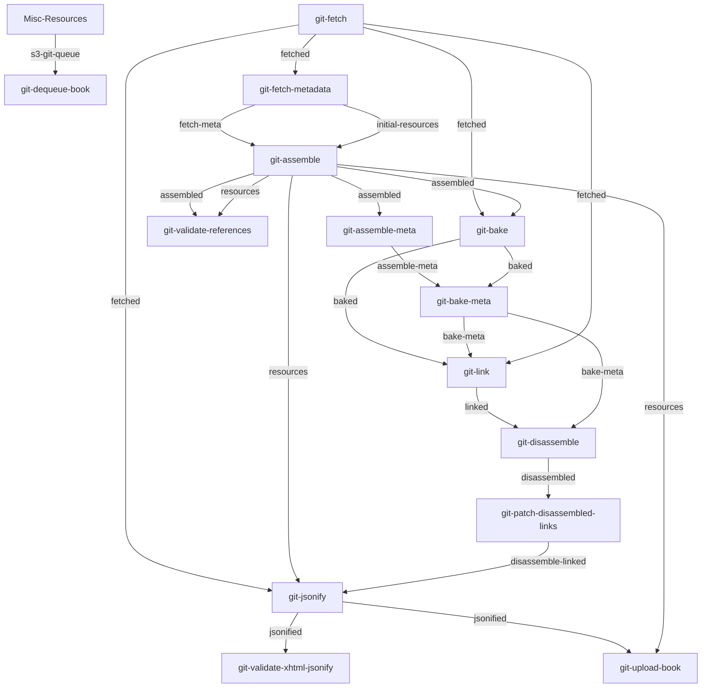
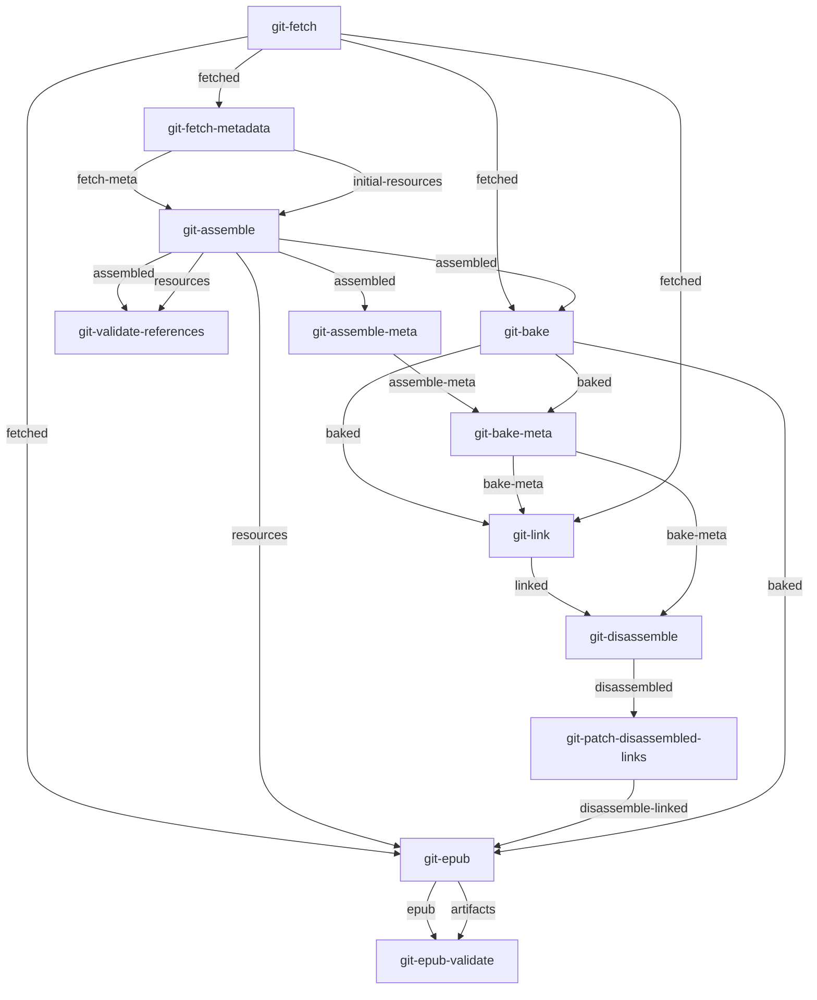
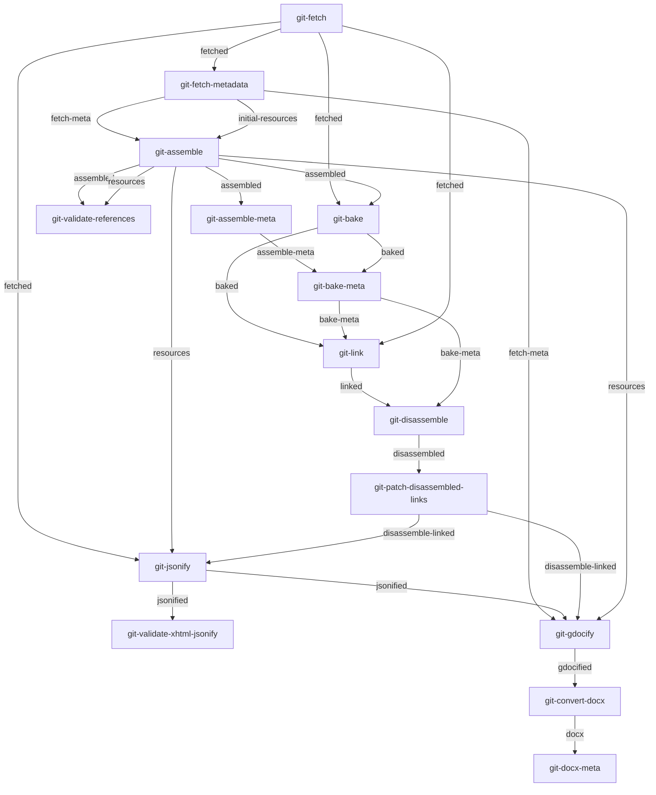

This file contains autogenerated images of the different pipelines.

They are generated by running `npm run build:graphs` in the parent directory.

- [all-git-pdf](#all-git-pdf)
- [all-git-web](#all-git-web)
- [all-git-epub](#all-git-epub)
- [all-git-gdoc](#all-git-gdoc)

## all-git-pdf

## all-git-web

## all-git-epub

## all-git-gdoc

