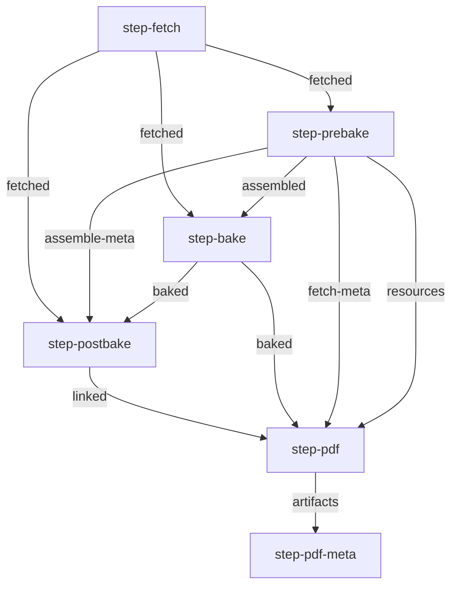

This file contains autogenerated images of the different pipelines.

They are generated by running `npm run build:graphs` in the parent directory.

- [all-pdf](#all-pdf)
- [all-web](#all-web)
- [all-epub](#all-epub)
- [all-docx](#all-docx)

## all-pdf

## all-web

## all-epub

## all-docx

