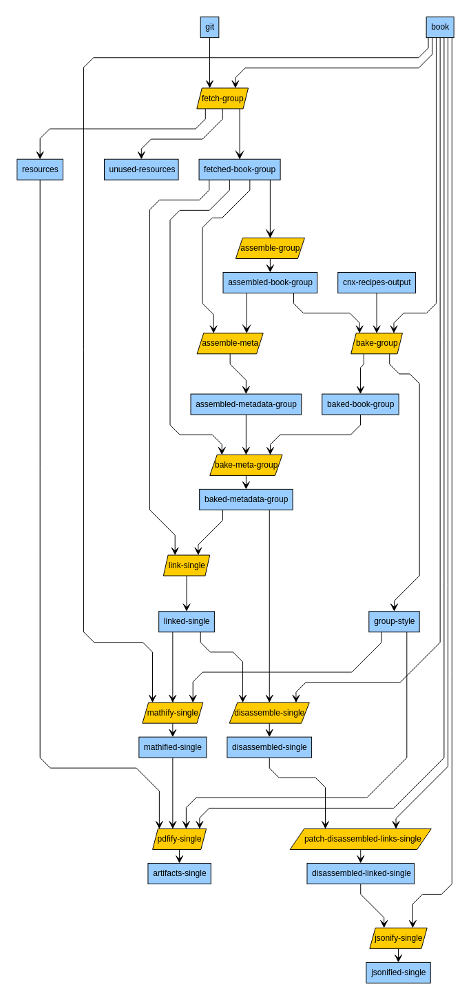

## Bakery CLI & Bakery Concourse Pipeline Configuration Generator

This directory contains the code necessary to both generate and run our content distribution pipelines:

- CORGI pipelines: PDF (ARCHIVE & GIT), WEB-HOSTING PREVIEW (ARCHIVE & GIT)
- WEB-HOSTING (ARCHIVE & GIT)
- GOOGLE DOCS

Pipelines reuse the same code, give or take some configuration.

## Bakery CLI

The Bakery CLI is used to generate entire pipelines and/or individual tasks of the pipeline.

Effort has been put in to paramaterize code pieces so that:

- A downstream user (user of the Bakery CLI)
- A developer making pipeline changes or debugging
- A production or staging node
- A CI node running tests

### Dependencies

To use the CLI, the following is required:

- docker
- docker-compose
- node >= 12.16.1
- npm

Note: Getting the above software installed is outside the scope of this documentation.

### Installation

To install the npm package:

```
$ npm -g i @openstax/bakery-cli
```

or, for local installation inside the `bakery` directory:

```
$ cd bakery
$ npm install
```

### Usage

#### >> With the npm @openstax/bakery-cli package installation

For the npm package installation, `bakery` is the entry point for the Bakery CLI.

Calling it without arguments will yield a help message:

```
$ bakery
bakery <command>

Commands:
  bakery run   run a bakery task
  bakery up    start up bakery-cli spawned containers
  bakery stop  clean up bakery-cli spawned containers

Options:
  -h, --help  Show help  [boolean]

Error: command required
```

Calling `bakery run` will yeild all possible subcommands in the CLI.

**Examples of Usage**

To fetch a book and have its contents appear in the directory `/data/prealgebra-2e`, one could use the following command:

```
$ bakery run fetch katalyst01.cnx.org col30939 latest -d ./data/prealgebra-2e
```

To assemble the book:

```
$ bakery run assemble col30939 -d ./data/prealgebra-2e
```

To link extras:

```
$ bakery run link-extras col30939 archive.cnx.org -d ./data/prealgebra-2e
```

To bake the book:

```
$ bakery run bake col30939 {path-to-recipe} {path-to-style} -d ./data/prealgebra-2e/
```

To mathify the book:

```
$ bakery run mathify col30939 -d ./data/prealgebra-2e/
```

To update links for REX:

```
$ bakery run link-rex col30939 -d ./data/prealgebra-2e/
```

To build the PDF:

```
$ bakery run build-pdf col30939 -d ./data/prealgebra-2e/
```

---

##### Using with kitchen recipes

There are two typical use cases for the CLI when testing / developing [kitchen recipes](https://github.com/openstax/recipes):

1. Building PDFs with the version of recipes on the `main` branch
2. Building PDFs with a local version of a recipe under development


Scenario 1 can be achieved by using the `bake-kitchen` CLI task in lieu of the `bake` task, where the first argument is the recipe name versus the path:

```
$ bakery run bake-kitchen col30939 {recipe-name} {path-to-style} -d ./data/prealgebra-2e/
```

Scenario 2 requires building a local Docker image with the desired recipe and invoking the CLI with the `-i` option. First, from the recipes directory:

```
$ cd recipes
$ docker build -f docker/Dockerfile -t localhost:5000/recipes:dev --target runtime-env .
```

Then, reference the image when invoking `bake-kitchen`:

```
$ bakery run bake-kitchen col30939 {recipe-name} {path-to-style} -d ./data/prealgebra-2e/ -i localhost:5000/recipes:dev
```

#### >> With local installation of the Bakery CLI

For now, when inside `/bakery` directory the file `src/cli/execute.js` is the entry point for the Bakery CLI, and must be called as an argument to `node`, e.g:

```
$ node ./src/cli/execute.js
```

Calling it without arguments (verbatim as above) will yield a help message:

```
execute.js <command>

Commands:
  execute.js run   run a bakery task
  execute.js up    start up bakery-cli spawned containers
  execute.js stop  clean up bakery-cli spawned containers

Options:
  -h, --help  Show help  [boolean]

Error: command required
```

Each task in the pipeline should have a corresponding subcommand in the CLI so that one may run it individually and locally.

**Examples of Usage**

To fetch a book and have its contents appear in the directory `/tmp/data`, one could use the following command, with `bakery` as their working directory:

```
$ cd bakery
$ node ./src/cli/execute.js run fetch staging.cnx.org col30149 latest -d /tmp/data
```

### New Git-Storage Compatible Tasks

Git-storage compatible tasks are not ready for use outside of the CE Tech yet.

The following graph represents the (almost) current state of git-storage compatible tasks. Intermediate states are shown in blue, tasks in yellow.


This graph is created with yED and the source file for it is located [here](./docs/pipelines.graphml).

The _bake-group_, _assemble-group_, _bake-meta-group_ and _assemble-meta-group_ tasks can be run with the `--single` flag to process only a single book.  
If the full book group has not been run through all these tasks, this flag is mandatory for running the _link-single_ task.

## Bakery Concourse Pipeline Configuration Generator

The Bakery Concourse Pipeline Configuration Generator is intertwined with the Bakery CLI as the Bakery CLI leverages the generation of tasks with the `build` executable. The same executable that is used to generate concourse pipeline/task files.

### Dependencies

- node >= 12.16.1
- npm

### Setup

**Install:**

```
$ cd bakery
$ npm install
```

**Environment Variables:**  
When generating pipelines for the local environment, the following environment variables are used for credentials:

| Environment variable    | Required to be set | Notes                                                                        |
| ----------------------- | ------------------ | ---------------------------------------------------------------------------- |
| `AWS_ACCESS_KEY_ID`     | Yes                | AWS credentials (likely for sandbox)                                         |
| `AWS_SECRET_ACCESS_KEY` | Yes                | AWS credentials (likely for sandbox)                                         |
| `DOCKERHUB_USERNAME`    | No                 | Docker Hub credentials (only needed if you're hitting rate limits otherwise) |
| `DOCKERHUB_PASSWORD`    | No                 | Docker Hub credentials (only needed if you're hitting rate limits otherwise) |
| `GH_SECRET_CREDS`       | Yes                | GitHub personal access token.                                                |

Note: May be empty string, if desired.

### Usage

`build` is an executable that provides a small cli to build your concourse pipeline/task files.

This is the help message returned by calling it with `./build --help`:

```
./build <command>

Commands:
  build.js pipeline <pipelinetype> [options] <env> [options]...  builds a bakery pipeline runnable with fly command
  [aliases: p]
  build.js task <taskname> [options]...  builds a bakery pipeline task runnable with fly execute     [aliases: t]

Options:
  --help  Show help                                                                                  [boolean]
```

For both the `pipeline` and `task` commands, the `--help` messages are fairly useful and will provide information about the command, defaults, and its positional and nonpositional arguments.

For pipeline:

```
$ ./build pipeline --help
```

For task:

```
$ ./build task --help
```

### Example of Usage

**Example:** Generate pipeline file for particular environment:

```
$ ./build pipeline <pipelinetype> [options] <env> [options]...
```

- The choices for `<pipelinetype>` are the basenames of the `.js` files in the `src/pipelines/` directory.
- The choices for `<env>` are the basenames of the `.json` files in the `env/` directory.

**Example:** Build the distribution pipeline with prod environment variables and output on stdout:

```
$ ./build pipeline distribution prod
```

**Example:** Build the cops pipeline with staging environment variables and output to file `cops-pipeline.staging.yml`, overwriting the file if it exists:

```
$ ./build pipeline cops staging -o cops-pipeline.staging.yml
```

**Example:** Generate a standalone task file suitable for `fly execute`:

```
$ ./build task <taskname> [options]...
```

- The choices for `<taskname>` are the basenames of the `.js` files in the `src/tasks/` directory.

**Example:** Build the look-up-book task, injecting the object `{bucketName: "my-bucket"}` as the argument to the task function, and output the result to stdout:

```
$ ./build task look-up-book -a "{bucketName: my-bucket}"`
```

**Example:** Build the fetch-book task, and output the result to the file `fetch-book-task.yml`

```
$ ./build task fetch-book -o fetch-book-task.yml`
```

Note: The `--args` option (shorthand, `-a`) must be valid `yaml` (or `json`, since yaml is a superset).

#### I don't like generating intermediate files to run `set-pipeline` or `execute`!

Use process substitution!
**Example:**

```
$ fly -t dev sp -p bakery -c <(./build pipeline cops staging)
```

## Development and QA

### Tip for development

The _Bakery CLI_ allows the user to specify an `image_resource` for concourse to run the task in instead of the default.

This is especially useful for either developing locally on the cops-bakery-scripts or perhaps being able to use the checked out code to create an image rather than using the image on Docker Hub when running tests.

There is some specific convention for how to do this sort of thing.

For example, if one wanted to make changes to cops-bakery-scripts and have those changes reflect in the _Bakery CLI_ running locally, one would have to follow these steps:

1. Change to bakery scripts as your working directory:

```
$ cd bakery/src/scripts
```

2. Make the desired change in the `src/scripts/*.py` file
3. Build the Docker image:

```
$ docker build .
```

4. Tag the build image as `localhost:5000/openstax/cops-bakery/scripts:latest`:

```
$ docker tag $(docker image ls | awk 'NR==2 {print $3}') localhost:5000/openstax/cops-bakery-scripts:latest
```

Note: The prefix of `localhost:5000` is _required_. The name and tag of your image is up to you.

5. Run the desired pipeline step with the CLI with the `--image` flag:

```
$ node ./src/cli/execute.js run assemble-meta --image localhost:5000/openstax/cops-bakery-scripts:latest -d /tmp/data col30149
```

Note: This is probably most useful for the `cops-bakery-scripts` image, but you can technically use a local version of an image like `nebuchadnezzar` as well.

### Tip for development, deployment, and QA

Both the _Bakery CLI_ and the _Pipeline Config Generator_ allow you to specify a tag of a remote image to use with the `--tag`.

For example, if a tag, `important-tag`, has been released for each of our images, one can:

1. Generate a pipeline pinning all versions of images to that tag with usage:

```
$ ./build pipeline cops staging --tag=important-tag
```

2. Run an individual task with the Bakery CLI using the image of that tag as the image_resource with usage:

```
$ node ./src/cli/execute.js run fetch -d /tmp/data staging.cnx.org col30149 latest --tag=important-tag
```

### Testing

Lint the JS files in `bakery`:

```

$ cd bakery
$ npm run lint

```

Fix linting errors if they occur:

```
$ npx standard --fix

```

Run regression tests in `bakery` via the CLI:

```
$ cd bakery
$ npm run test
```

Test python scripts in the bakery tasks located in `bakery/src/tests`:

```
$ apt-get install -y imagemagick icc-profiles-free ghostscript
$ pip install bakery/src/scripts/.[test]
$ pytest bakery
...

On subsequent tests:

```
$ pip install bakery/src/scripts/.[test] && pytest bakery
```
