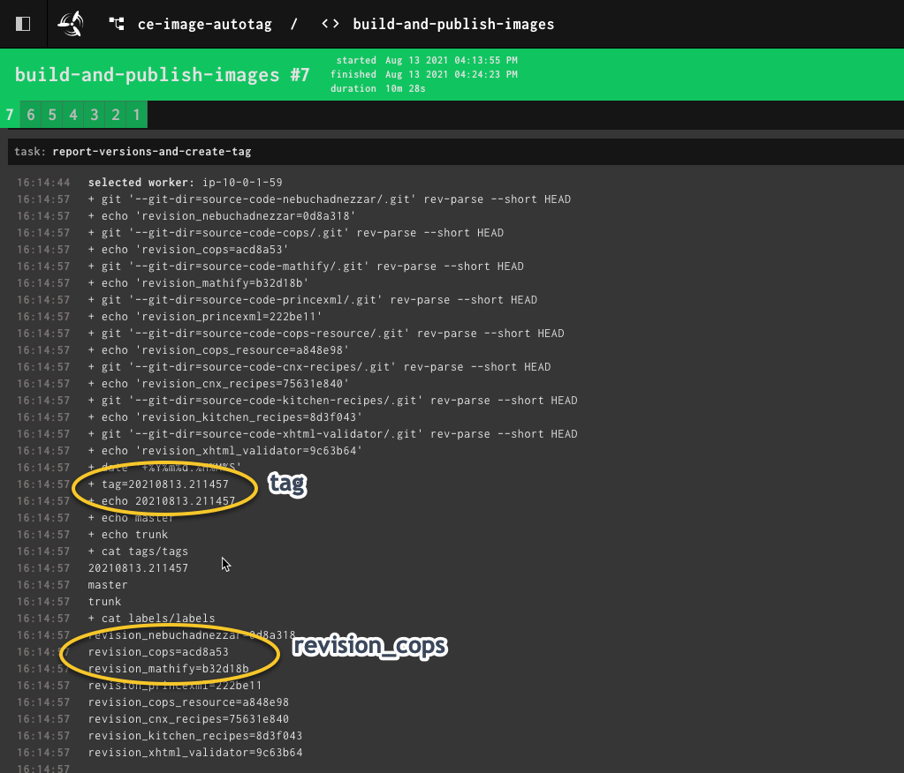

.. _distribution-pipeline-prod-steps:

######################################
Staging and Production Pipeline Deploy
######################################

The following instructions are used to deploy the webhosting pipeline to Concourse for both staging
and production deployments. The instructions will assume we're deploying to staging and all steps
can be completed for production with all references to ``staging`` replaced with ``prod``.

**STEP 1: Get the correct tag and sha to be used for the deployment**

.. note::
   There are two key pieces of information that are required to deploy the webhosting pipeline:

   1. The tag that is applied to every piece of software used to produce a book. This allows us to ensure our books are
      idempotent. A book should build the same way every time given the same tag for every dependency used to produce the
      book. In other words, given the same content version and code version we should always produce the same book.
   2. The commit sha to be used to checkout the correct version of the output-producer-service repository.

Log into the Concourse server where the ``ce-image-autotag`` pipeline is running.

Select to view the jobs inside of the ``ce-image-autotag`` pipeline and select the most recent job.

Find ``report-versions-and-create-tag`` task within the job.

Take note of the ``tag`` and the ``cops_revision`` sha that is shown in the image above

- **tag**: ``20210813.211457``
- **cops_revision**: ``acd8a53``

**STEP 2: Checkout the right version of output-producer-service using the sha**

.. code-block:: bash

   # Clone down the repository, if you haven't already.
   git clone git@github.com:openstax/output-producer-service.git

   # Change directories
   cd output-producer-service

   # Checkout the correct version using the sha noted above.
   git checkout acd8a53

**STEP 3: Generate the pipeline configuration using the build command**

Ensure you are in the root of the output-producer-service directory

.. code-block:: bash

   # Change into the bakery directory
   cd bakery

   # Run the build command specifying distribution pipeline with the tag and pipe to a file
   ./build pipeline distribution staging -t 20210813.211457  > webhost-staging-20210813.211457.yml

**STEP 4: Use** ``fly``** command to set the pipeline in Concourse **

For the following steps we'll login into Concourse using ``fly`` and set the pipeline.

.. code-block:: bash

   # Login to Concourse using fly, if you haven't already. Follow instructions to login.
   fly --target v7 login --concourse-url https://concourse-v7.openstax.org --team-name CE

   # Use the set-pipeline command to configure the pipeline in Concourse
   fly --target v7 set-pipeline -c webhost-staging-20210813.211457.yml -p webhost-staging-20210813.211457

   # Unpause the pipeline so that it starts working
   fly --target v7 unpause-pipeline -p webhost-staging-20210813.211457