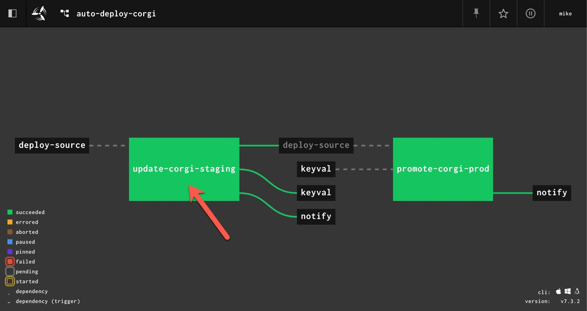
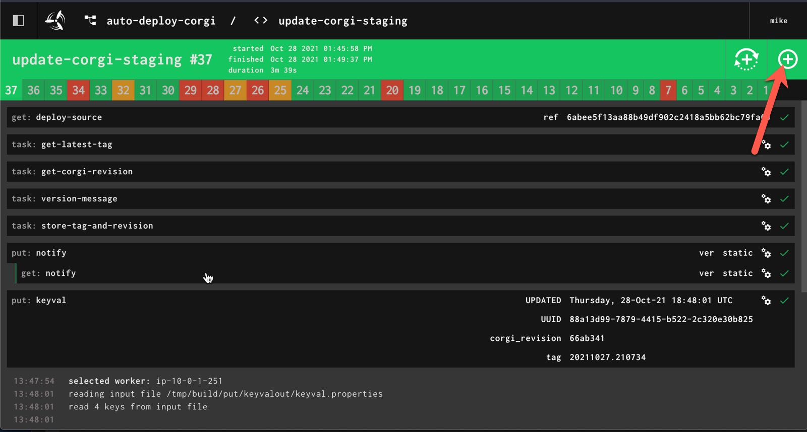
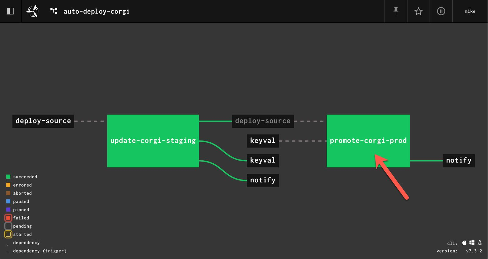
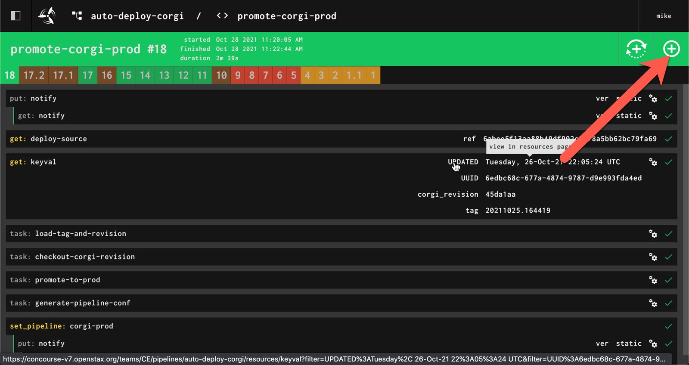

.. _operations-updating-the-stack:

#############################
Update and Deploy CORGI Stack
#############################

**********************
The 2-Part Stack Story
**********************
The CORGI system is composed of 2 parts, the **CORGI Dashboard** (Backend, Frontend, etc.) and **CORGI Pipeline**.

The parts can be deployed separately, but we've decided to keep the entire CORGI stack
in sync, by making sure they are always deployed together.

Therefore, if changes are only made to the CORGI Pipeline the CORGI System (Docker Swarm) will still need a deployed.
Vice versa, if changes are made to the CORGI System a new CORGI Pipeline will need to be set.

1. The CORGI Dashboard is deployed using `Docker Swarm <https://docs.docker.com/engine/swarm/>`_.
=================================================================================================

Docker Swarm provides a ``docker stack`` command that will deploy and update a set of services based on a docker-compose file.

Refer to :ref:`operations-setting-up-the-swarm` to do the initial setup of the servers with swarm.

2. The CORGI Pipeline is set on a Concourse server.
===================================================

The CORGI pipeline is set up using Concourse through the use ``fly``, Concourse's CLI, or via ``set-pipeline`` from within a pipeline config.

*****************************
Automated Deployment of CORGI
*****************************

1. Open the `auto-deploy-corgi pipeline <https://concourse-v7.openstax.org/teams/CE/pipelines/auto-deploy-corgi>`_
==================================================================================================================

2. Click on the "Update CORGI Staging" job
==========================================

3. Click the + plus sign in the top right to start a new job
============================================================

Congratulations you've now deployed the environment to `staging <https://corgi-staging.openstax.org>`_!

4. Promote the stack to production
==================================

When testing has been completed on `staging <https://corgi-staging.openstax.org>`_ and we have the go ahead
to deploy to production we can return to the main job screen and click on `promote-corgi-prod <https://concourse-v7.openstax.org/teams/CE/pipelines/auto-deploy-corgi/jobs/promote-corgi-prod/builds/18>`_.

5. Click the + plus sign in the top right to start a new promote to production job
==================================================================================

This step is similar to step 3 for staging. Simply click the `+` sign and you'll promote the entire stack and pipeline
to `production <https://corgi.openstax.org>`_!

**************************
Manual Deployment of CORGI
**************************

Overview of Steps
=================

Set Up SSH Config for implicit tunnel
   - Set up Portforwarding to AWS by Tunneling through Bastion2. Bastion2 is the only with permission to talk to the AWS Server. Where our CORGI Stack is deployed.
   - Set up Terminal for Communication with Docker Swarm Manager Node
Deploy CORGI Stack to Staging
   - Deployment to Staging with newly build and tagged images to make sure new images work.
Promote CORGI Stack to Production
   - Promote the CORGI Stack to Production after successful deploy to Staging.
Build and Push Docker Images
   - Build, Tag, and Push updated images.

----

.. _Prereq Update the Stack:

Prerequisites
=============

**Use Python 3.8.x when possible**, Python 3.9.x and above is not supported yet. It may be useful to use pyenv.

1. Install `Paramiko <https://pypi.org/project/paramiko/>`_
-----------------------------------------------------------
This will ensure you can use SSH to manage the docker swarm nodes.

**It is recommended to install paramiko, deploy to staging, and promote to production in a python virtual enviornment.**

.. code-block:: bash

   pip install paramiko

2. Set up Port Forward to CORGI Server (AWS) through Bastion2
-------------------------------------------------------------
**Make sure you already have local identity files to:**

   - ``bastion2.cnx.org`` (e.g. at ~/.ssh/bastion2_id_rsa)
   - ``corgi.openstax.org`` (e.g. at ~/.ssh/corgi.pem).

**Configure your** ``~/.ssh/config`` **with identity files:**

.. code-block:: bash

   Host bastion2
      HostName bastion2.cnx.org
      User <user>
      IdentityFile ~/.ssh/id_rsa
      ForwardAgent yes
   Host corgi
      User ubuntu
      HostName corgi.openstax.org
      IdentityFile ~/.ssh/corgi.pem
      ProxyJump bastion2
      ForwardAgent yes

You can copy down your ``corgi.pem`` into your ``~/.ssh`` from bastion2 by:

.. code-block:: bash

   $ cd ~/.ssh/
   $ scp <user>@bastion2:~/.ssh/corgi.pem .

.. note:: Example above assumes that a copy of ``corgi.pem`` for  **IdentityFile** is copied to where your ssh keys are.

3. Check if you use the docker-compose v1 in your PATH
------------------------------------------------------

docker-compose 2 beta may be used as standard on new docker installations (2021-07-22). But we need docker-compose 1.x for our deployment.

Check the docker-compose version

.. code-block:: bash

   $ docker-compose --version

*If you see a version >= 2.x we need to manual install the last 1.x version.* The steps are similar for Mac and Linux.

Download `latest 1.x release from github <https://github.com/docker/compose/releases>`_ and make it available in your path.

Code example for Mac. You can change directories and version to your liking.

.. code-block:: bash

   $ mkdir -p ~/tmp/docker-compose
   $ cd ~/tmp/docker-compose
   $ curl -o docker-compose https://github.com/docker/compose/releases/download/1.29.2/docker-compose-Darwin-x86_64
   $ chmod +x docker-compose
   $ export PATH="~/tmp/docker-compose:$PATH"

If you run

.. code-block:: bash

   $ docker-compose --version

you should see version 1.x.

Note: After the deployment you can delete the directory `~/tmp/docker-compose`.

----

CORGI Stack Deploy Steps
========================

0. Update Buildout and JS Dependencies
--------------------------------------

**Make sure you are checked out to the** `git-ref` **of the latest output-producer-service tagged deploy.**

.. code-block:: bash

   $ cd output-producer-service
   $ git checkout <git-ref>
   $ git pull

Refer to :ref:`operations-find-git-ref` to find a git-ref with given TAG.

**Update/install JS libraries regularly for the fly command later:**

.. code-block:: bash

   $ cd bakery
   $ npm install    # yarn v1.x also works
   $ cd ..

1. Deploy CORGI System to Staging Swarm
---------------------------------------

.. note:: This window should only be used to run the deploy script.
   All docker commands you run in this window will be like running them on the remote host.

**In a fresh terminal window, configure Docker to use the remote host (established prior):**

.. code-block:: bash

   $ export DOCKER_HOST="localhost:9999"

The above command will set up the terminal window to communicate with Docker Swarm Manager Node 
that was set up in the previous step.

**Continue in terminal window, set staging environment variables:**

.. code-block:: bash

   $ source ./scripts/vars.staging.sh

The above script will set the staging environment variables for your deploy.

**Continue in terminal window, set code version tag environment variable:**

.. code-block:: bash

   export TAG="tag-of-your-choosing"  ## i.e. 20200612.204804

The above command will set the environment variable for the code version of your choice.    

Refer to :ref:`operations-select-code-version-tag` to find a tag.

**Continue in terminal window, deploy to staging:**

.. code-block:: bash

   ./scripts/deploy.sh

The above script will deploy the Docker Swarm System with the previously set staging environment variables.

.. warning::
   The deploy script will fail and exit without deploying if any of the required environment variables are not set.

2. Set up CORGI Pipeline, on Concourse
--------------------------------------

**Continue in the same terminal from deploy, login to Concourse via** ``fly`` **:**

.. code-block:: bash

   fly login -t concourse-v6 -c https://concourse-v6.openstax.org/ -n CE

**Continue in terminal window, deploy the corresponding pipeline to** ``concourse-v6`` **(BASH shell):**

.. code-block:: bash

   fly -t concourse-v6 sp -p corgi-staging -c <(./bakery/build pipeline cops staging --tag $TAG)

The above ``fly`` command will set a new pipeline named ``corgi-staging`` with staging pipeline variables.
The above assumes ``fly`` is installed. Depending on your environment, you may need to get the correct 
version of fly from the UI.

3. Promote Staging to Production
--------------------------------
Once Staging CORGI stack looks good and is tested (Steps 3 & 4) ensure that:

- You have the same version checked out (step 0)
- SSH tunnel to CORGI is up (step 1).
- You have all environment variables set up (step 2 **without** deploy script at the end)
- You are logged in with fly (fly login in step 3)

**Continue in terminal window, promote staging to deploy:**

.. code-block:: bash

   ./scripts/promote-deploy.sh

The above deployment script will automatically detect the tag deployed to staging and deploy it to production.
There is no need to set any environment variables for production or pick a tag.

**Continue in terminal window, deploy the corresponding pipeline to** ``concourse-v6`` **:**

.. code-block:: bash

   fly -t concourse-v6 sp -p corgi-prod -c <(./bakery/build pipeline cops prod --tag $TAG)

----

The above ``fly`` command will set a new pipeline named ``corgi-prod`` with production pipeline variables.

4. Cleanup
----------
Close all terminal windows when deployment is complete.

----

***************************
Rotating Basic Auth Secrets
***************************

Due to the sensitive nature of managing secrets we keep the instructions on how to rotate them in
`Confluence <https://openstax.atlassian.net/wiki/spaces/CE/pages/670760961/CORGI+Basic+Auth+Credentials+Management>`_.
